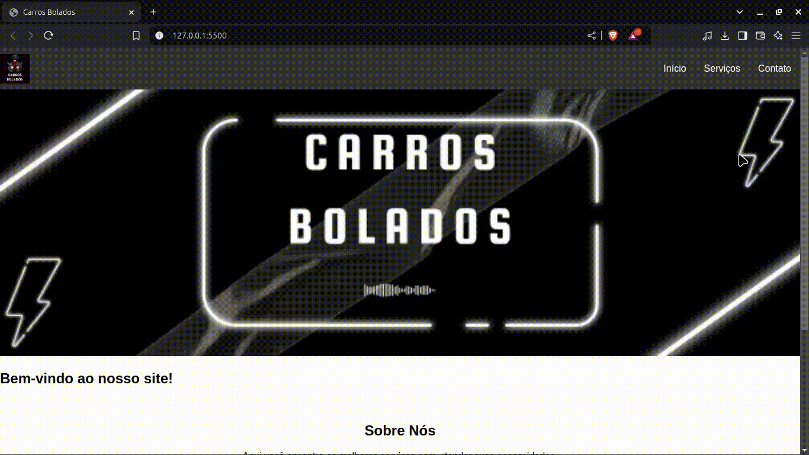

# Projeto Carros Bolados
  


>Status do Projeto: ⚠️ em desenvolvimento

### Tópicos 

- [Descrição do projeto](#descrição-do-projeto)

- [Visualização da Aplicação](#visualização-da-aplicação)

- [Como rodar a aplicação](#como-rodar-a-aplicação)


## Descrição do projeto 

<p align="justify">
O projeto Carros Bolados é um site dinâmico e responsivo desenvolvido para apresentar os serviços e promoções de uma empresa do setor automotivo. Com uma interface intuitiva, o site é estruturado em HTML5 e utiliza CSS para estilização, garantindo uma experiência visual atraente e moderna.
</p>
 

## Visualização da Aplicação: 🔗


> Link da visualisação da aplicação: https://keven-costa.github.io/carros-bolados/pages/


## Como rodar a aplicação: ▶️

No terminal, clone o projeto: 

```
git@github.com:Keven-Costa/carros-bolados.git
```

## Licença 

The [MIT License]() (MIT)

Copyright: ©️ 2024 - Carros Bolados